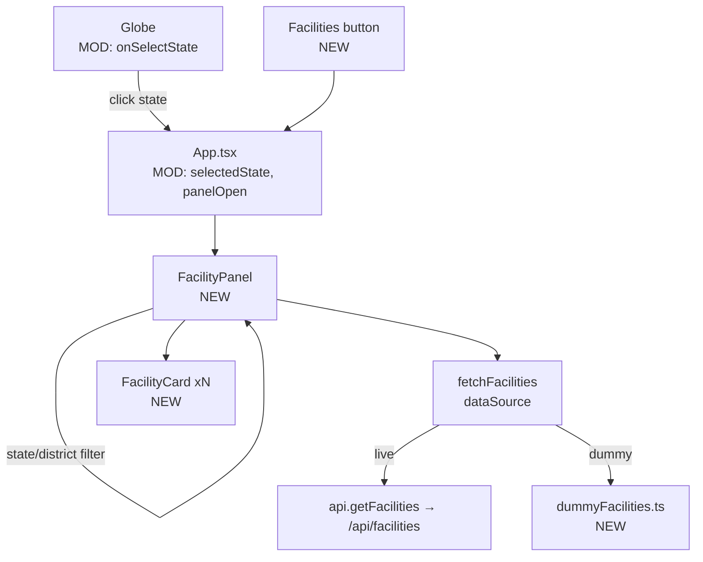
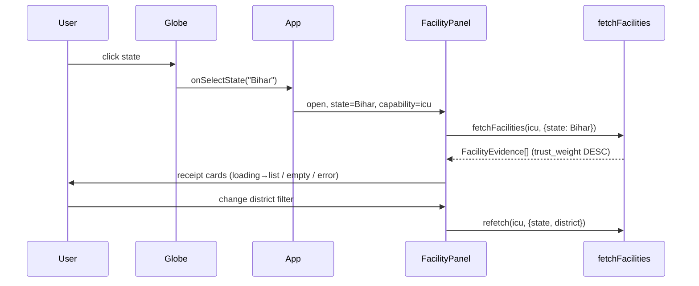

# Facility Receipts Panel — Design

**Date:** 2026-07-19
**Status:** Approved (design), implementing
**Goal:** Surface the facility-level evidence behind each region's verdict — a
right-side drawer of "receipt" cards showing *why* a facility counts (source
trust, corroboration, evidence snippets), for the selected capability + state.

## Context

`/api/facilities` (contract in `frontend/src/lib/api.ts` → `FacilityEvidence`) is
implemented and returns rows ordered by `trust_weight DESC, knowledge DESC`,
filterable by `capability`, `state`, `district`, `candidates_only`, `limit≤500`.
The client (`api.getFacilities`) and `fetchFacilities` in `dataSource.ts` already
exist; no UI consumes them (`fetchFacilities` returns `[]` in dummy mode). The
Globe (`react-globe.gl`) has a hover tooltip but no click handler.

## Approach

A right-side **drawer** (~380px) over the globe, opened two ways ("Both"):
- **Click a state** on the globe → `onPolygonClick` → open pre-filtered to that state.
- **"Facilities" button** in the header → open with no filter; pick state/district
  from in-panel selects.

The drawer owns its own data fetch keyed on `(capability, state, district)` and
renders a scrollable list of receipt cards. Closes via X or Esc; globe stays
visible and interactive.

### Components (new)

- **`FacilityPanel.tsx`** — drawer shell + header filters (state select, district
  select) + fetch/loading/empty/error + list. Props:
  `{ open, capability, state, district, onStateChange, onDistrictChange, onClose,
  states }` (states list derived from the loaded regions).
- **`FacilityCard.tsx`** — one `FacilityEvidence` as a receipt:
  - name + **tier** badge + candidate flag; `district · state · pin`.
  - trust row: `source_trust` and `knowledge` as 0–1 bars (→ %), `data_confidence`
    label, `trust_weight` value.
  - corroboration: `n_corroborating` corroborating · `claiming` claiming.
  - **evidence receipts:** `evidence[]` as `field → snippet` rows (the core).
  - `description` when present; `source_urls` parsed defensively into links.

### Wiring (existing files)

- **`App.tsx`**: add `selectedState`, `districtFilter`, `panelOpen` state; render
  `<FacilityPanel>`; add a header **"Facilities"** button; pass `onSelectState` to
  the Globe. Derive the state list from loaded `regions`.
- **`Globe.tsx`**: add optional `onSelectState?(state: string)` prop, wired to
  `onPolygonClick` for state polygons only. Hover tooltip unchanged.
- **`dataSource.ts` / new `dummyFacilities.ts`**: add `DUMMY_FACILITIES`; in dummy
  mode `fetchFacilities` filters them by state/district so the panel is
  verifiable in `vite dev` and demoable offline. Live path unchanged.

## Diagrams

## States & edges

- **Loading** spinner during fetch; **empty** ("No facilities for <state> · <cap>");
  **error** message on fetch failure (drawer stays open).
- `source_urls` is a loose string — split on whitespace/commas, render `http(s)`
  tokens as links, ignore the rest.
- Null-safe: `pin`, `description`, `latitude/longitude`, `source_urls` may be null.
- Dummy mode: `[]` unless a matching `DUMMY_FACILITIES` state — panel shows real
  cards for demo states, empty otherwise.

## Scope

- **In:** drawer, receipt cards (full trust + evidence), both triggers, dummy data.
- **Out:** selected-state highlight on the globe, pagination beyond `limit=100`,
  grouping cards by district (flat list + district filter instead).

## Files touched

- New: `frontend/src/components/FacilityPanel.tsx`,
  `frontend/src/components/FacilityCard.tsx`,
  `frontend/src/lib/dummyFacilities.ts`.
- Mod: `frontend/src/App.tsx`, `frontend/src/components/Globe.tsx`,
  `frontend/src/lib/dataSource.ts`.
- Rebuild + recommit `frontend/dist`.
- No backend changes.
