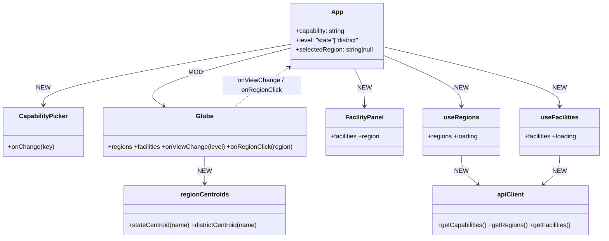
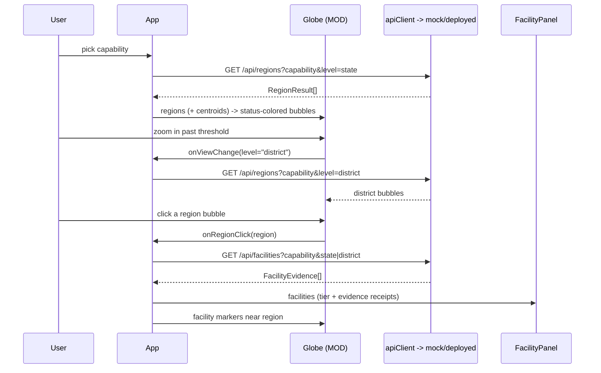

# India Medical Desert Globe — Design

**Date:** 2026-07-19
**Status:** Approved design (realigned to the deployed API), pre-implementation

## Problem

We have an interactive 3D globe (`react-globe.gl`) that currently renders a dummy
H3 hexbin "heatmap" over India. It is (1) laggy — the client tessellates all of
India into H3 cells and extrudes a 3D prism per cell on every zoom — and (2) fed
by dummy data.

A teammate has **already built and deployed** a FastAPI backend (the "Medical
Desert Planner", Track B). The globe must be driven by that API. This spec is
realigned to the **real, deployed contract** (see `docs/07-api.md`,
`api/openapi.json`, `data_eng/`), replacing an earlier draft that assumed an
H3/bbox tile API we do not have.

## What the backend actually is (authoritative)

- **Geography is region-based, not tile-based.** There is **no bbox/H3 endpoint.**
  The API rolls facilities up to **state** or **district** and joins NFHS-5 health
  need to classify each region as a medical desert / data desert / served.
- **Confidence is a trust model, not a single number.** Facility claims are scored
  by cross-field corroboration (`trust_scoring.py`) and source provenance
  (`source_trust.py`); regions expose trust-weighted `coverage`, `knowledge`
  (completeness), `priority_score`, and a `status`.
- **Auth:** the app is behind Databricks workspace SSO/OAuth. For local
  development we **do not touch Databricks** — we run a local mock (below).

### Deployed endpoints (base from `docs/07-api.md`)

- `GET /api/capabilities` →
  `{ "capabilities": ["ICU","NICU","Emergency care","Maternity","Oncology","Trauma center"] }`
- `GET /api/regions?capability=<c>&level=state|district&limit=<n>` → `RegionResult[]`:
  `region, facilities, claiming, corroborated, coverage(0..1), knowledge(0..1),
  health_need(0..1|null), priority_score(0..1), status`
  (status ∈ 🔴 medical desert / 🟡 data desert / 🟠 claimed-unverified / 🟢 served)
- `GET /api/facilities?capability=<c>&state=<s>&district=<d>&limit=<n>` →
  `FacilityEvidence[]`: `facility_id, name, state, district, pin, tier,
  trust_weight, knowledge, evidence:[source_field, matching_text][],
  description, latitude, longitude, source_urls`

Regions do **not** carry lat/lon in the HTTP contract; the district rollup
computes centroids internally (`district_rollup.py`). For v1 markers we derive a
region centroid client-side (see Geometry).

## Goals (v1)

- User picks a **capability** (from `/api/capabilities`).
- Globe shows **one marker per region** (state, or district when zoomed in),
  colored by `status` and sized by `priority_score` — a medical-desert map.
- Clicking a region opens a **facility receipts** panel: the facilities behind
  that region's score, each with its trust `tier` and row-level `evidence`
  citations.
- Smooth performance (≤ ~706 district markers, not thousands of H3 prisms).
- Keep the `react-globe.gl` globe aesthetic.
- **Develop entirely locally** against a mock of the three endpoints.

## Non-goals (deferred)

- H3 / bbox shrinking-hexagon tiles (backend doesn't support it).
- District-boundary choropleth polygons (needs ~700-polygon India district
  GeoJSON; use centroid bubbles instead for v1).
- Live Databricks hosting / auth (packaging step at the very end — see below).
- Ranked desert list panel (`rank_deserts`) — easy follow-up, not v1.

## Key decisions

- **Region model, not tiles.** Zoom selects **grain**: zoomed out → `level=state`;
  zoomed in past a threshold → `level=district`. This preserves the
  "granularity changes with zoom" feel without any H3.
- **Markers, not choropleth.** Render each region as a bubble at its centroid,
  `color = status`, `size = priority_score` (fallback `health_need`). Cheap on
  the globe and matches `react-globe.gl` `pointsData`/`htmlElementsData`.
- **Confidence is shown as tier + receipts**, never a bare number: region tooltip
  shows `coverage`, `health_need`, `priority_score`, `claiming`/`corroborated`;
  facility rows show `tier` + the `evidence` snippets.
- **Coordinate hygiene client-side.** Defensively hide any marker whose centroid
  falls outside India's bbox (~lat 6–37, lng 68–98), since upstream coords contain
  junk (e.g. a facility at lng −38, lat 59) that can skew a centroid.
- **Local mock is the dev backend.** A tiny local server implements the three
  endpoints from the in-repo sample data so the UI builds with zero Databricks
  dependency. `VITE_API_BASE` switches between the mock and the deployed app.

## Geometry: where region centroids come from

- **Facility mode** already has `latitude`/`longitude` per facility — used
  directly for facility markers.
- **Region markers** need a centroid. The HTTP `RegionResult` has no lat/lon, so
  v1 derives it client-side from a small static lookup:
  - `state` → static India state centroid table (36 entries, vendored in
    `frontend/src/lib/regionCentroids.ts`).
  - `district` → centroid from the **pincode directory** (average the
    district's pincode lat/lngs once, at build time, into a vendored JSON), with
    the India-bbox clamp applied.
- If a region can't be geolocated, it still appears in any list UI but is skipped
  on the globe (logged, not silently dropped).

## Diagrams

### Component structure

### Runtime flow

## Rendering approach (Globe, MOD)

- **Remove** the client-side H3 machinery (`buildHeatPoints`, `HOTSPOTS`,
  `weightAt`, `polygonToCells`, hexBin props).
- **Region layer:** `pointsData` (or `htmlElementsData` for nicer labels) at
  region centroids; `pointColor` = status palette, `pointRadius`/altitude =
  `priority_score`. Tooltip = coverage/need/priority + claiming/corroborated.
- **Facility layer:** on region click, `pointsData` for that region's facilities,
  colored by `tier`; hover/click surfaces the facility; the `FacilityPanel` lists
  them with `evidence` citations and `source_urls`.
- **Zoom → level:** reuse an altitude threshold to flip `level` state→district and
  refetch `/api/regions`. Debounce (~250 ms).
- Keep country outlines + India framing as today.

## Status palette (legend)

| status | meaning | color |
|---|---|---|
| 🟢 served | trusted supply meets need | green |
| 🟠 claimed-unverified | claims present, weak corroboration | amber |
| 🟡 data desert | too few records to judge | grey/yellow |
| 🔴 medical desert | high need, low trusted supply | red |

Exact strings come from the API; map defensively (unknown status → neutral grey).

## Data-fetching (NEW hooks)

- `useRegions(capability, level)` → fetches `/api/regions`, cancels superseded
  requests (AbortController), returns `{ regions, loading, error }`. No fetch
  until a capability is chosen.
- `useFacilities(capability, region)` → fetches `/api/facilities` on region
  select; same cancellation semantics.

## Local mock backend (NEW)

- `frontend/mock/server.mjs` — a tiny Node HTTP/Express server implementing the
  three endpoints against the in-repo sample data, matching the response shapes
  in `docs/07-api.md`. Trust scoring can be **approximated** (keyword corroboration
  across `capability`/`procedure`/`equipment`/`description`/`specialties`) — UI
  fidelity, not scoring parity, is the goal. Capabilities returned verbatim as the
  deployed 6.
- `frontend/src/lib/api.ts` reads `import.meta.env.VITE_API_BASE`
  (default `http://localhost:8787` = mock). Swapping to the deployed app is an
  env change only.

## Path to Databricks (later, one step — not now)

`npm run build` → serve `frontend/dist` as static files from the same FastAPI app
that exposes `/api/*`. Same origin → no CORS, SSO covers auth. ~20-min packaging
task once the UI is stable; explicitly **out of scope** for active development.

## Files

- `frontend/src/components/Globe.tsx` — **MOD**: drop H3 machinery; render region
  bubbles + facility markers; emit `onViewChange(level)` / `onRegionClick`.
- `frontend/src/components/CapabilityPicker.tsx` — **NEW**.
- `frontend/src/components/FacilityPanel.tsx` — **NEW**: receipts (tier + evidence).
- `frontend/src/hooks/useRegions.ts`, `useFacilities.ts` — **NEW**.
- `frontend/src/lib/api.ts` — **NEW**: typed client, `VITE_API_BASE`.
- `frontend/src/lib/regionCentroids.ts` (+ vendored district centroid JSON) — **NEW**.
- `frontend/mock/server.mjs` — **NEW**: local mock of the three endpoints.
- `frontend/src/App.tsx` — **MOD**: wire picker + globe + panel + state (capability,
  level, selectedRegion).

## Error / edge handling

- Capability unselected → base globe only, no fetch.
- Empty region/facility list → clear layers (no stale render).
- Region without a resolvable centroid → omit from globe, log; still valid in lists.
- API/mock error → non-blocking inline notice; keep last good view.
- Superseded request → aborted silently.
- Facility `limit` hit → "showing first N" note (no silent truncation).

## Testing

- Unit: altitude→level threshold; centroid lookup + India-bbox clamp; status→color
  mapping (incl. unknown status).
- Hooks: `useRegions`/`useFacilities` debounce, cancel superseded, clear on empty.
- Mock: endpoints return contract-shaped payloads for each capability.
- Manual/e2e (Playwright probe as today): pick a capability → status-colored
  region bubbles; zoom → district grain; click a region → facility receipts panel;
  confirm no multi-second stalls.
