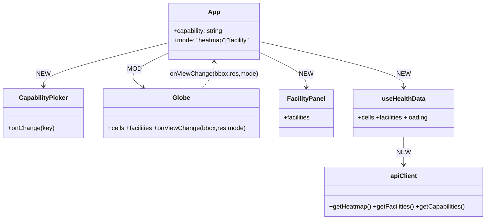
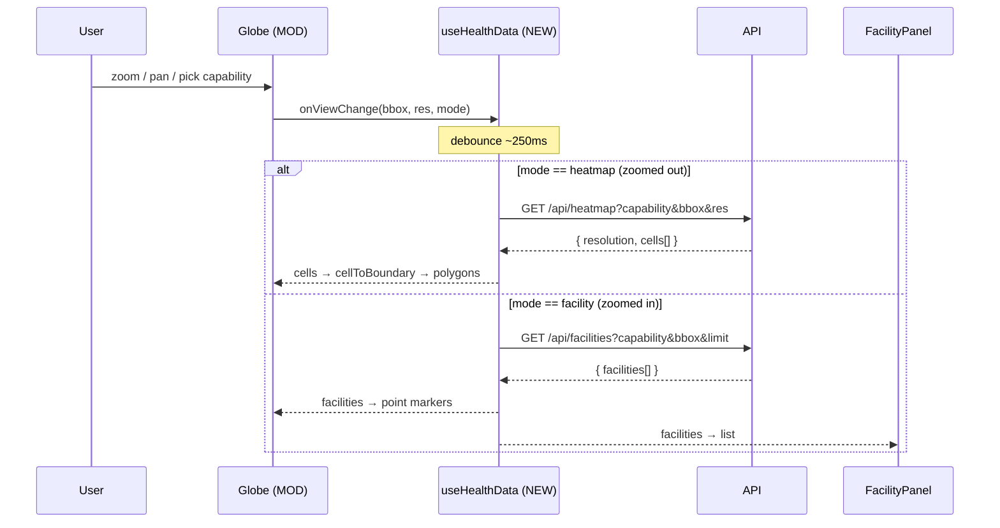

# India Healthcare Capability Globe — Design

**Date:** 2026-07-19
**Status:** Approved design, pre-implementation

## Problem

We have an interactive 3D globe (`react-globe.gl`) that currently renders a dummy
H3 hexbin "heatmap" over India. Two problems:

1. **It's laggy.** The client tessellates all of India into H3 cells
   (`polygonToCells` over the full India MultiPolygon) and extrudes a 3D prism
   per cell on *every* zoom change. At higher resolutions that is thousands of
   cells rebuilt on the main thread.
2. **It's dummy data.** We need to show real healthcare facilities keyed by a
   user-selected **capability** (a medical specialty such as ICU, maternity,
   oncology), backed by a teammate's API.

We cannot query every region of India at once, and granularity must scale with
zoom (like vfmatch.org: hexes shrink as you zoom in).

## Goals (v1)

- User selects a **capability**; globe shows where facilities providing it exist.
- **Heatmap mode** (zoomed out): H3 cells shaded by facility count / confidence.
- **Facility mode** (zoomed in): individual facility markers + a side panel
  listing each facility with its **confidence score**.
- Smooth performance — no main-thread tessellation of all of India.
- Keep the `react-globe.gl` globe aesthetic.

## Non-goals (deferred)

- State/region dropdown filter.
- NFHS-5 "health need vs. supply" overlay (the medical-desert angle).
- Precomputed vector tiles.
- Explicit client-side coordinate cleaning (handled implicitly — see below).

## Key decisions

- **Capability = the `specialties` enum** on each facility row (`cardiology`,
  `criticalCareMedicine`, `gynecologyAndObstetrics`, `medicalOncology`, …). The
  column literally named `capability` is free-text facts and is NOT the selector;
  it may be shown as supporting detail on a facility card.
  - ICU → `criticalCareMedicine`; maternity → `gynecologyAndObstetrics` /
    `obstetricsAndMaternityCare`; oncology → `medicalOncology` /
    `surgicalOncology`.
- **Confidence score comes from the API** — a per-facility, per-capability value
  in `[0, 1]`. The frontend only displays it.
- **Granularity + performance = server-side H3 aggregation.** The frontend sends
  a bounding box + zoom-derived H3 resolution; the API returns only **non-empty**
  aggregated cells. No client tessellation, no India-filling cell set.
- **Coordinate hygiene is server-side and implicit.** The API only aggregates /
  returns facilities whose coords fall in the India bbox (~lat 6–37, lng 68–98),
  so garbage coordinates (e.g. a hospital at lng −38, lat 59) never reach the map.
- **Zoom drives the mode switch.** Above a zoom threshold the client calls the
  facilities endpoint instead of the heatmap endpoint. (No region selection in v1.)

## API contract (we define it; teammate implements)

All responses JSON. `bbox` is `west,south,east,north` in degrees. `res` is an H3
resolution integer.

### `GET /api/capabilities` (optional; may be hardcoded client-side for v1)
```json
{ "capabilities": [ { "key": "criticalCareMedicine", "label": "ICU / Critical Care" } ] }
```

### `GET /api/heatmap?capability=<key>&bbox=<w,s,e,n>&res=<int>`
Aggregated, India-clamped, capability-filtered. Only non-empty cells.
```json
{
  "resolution": 4,
  "cells": [ { "h3": "83a1e5fffffffff", "count": 12, "avgConfidence": 0.71 } ]
}
```

### `GET /api/facilities?capability=<key>&bbox=<w,s,e,n>&limit=<int>`
Individual facilities in view, for facility mode.
```json
{
  "facilities": [
    {
      "id": "fadba1a4-...",
      "name": "Shaurya Hospital",
      "lat": 23.0107, "lng": 72.5626,
      "facilityType": "hospital", "operatorType": "private",
      "confidence": 0.82,
      "specialties": ["criticalCareMedicine", "orthopedicSurgery"],
      "city": "Ahmedabad", "state": "Gujarat"
    }
  ]
}
```

## Diagrams

### Component structure



### Runtime flow (per zoom / pan, debounced)



## Rendering approach (Globe, MOD)

- **Heatmap mode:** convert each returned H3 cell to its boundary via h3-js
  `cellToBoundary(h3, true)` and render as **flat filled polygons**
  (`polygonsData`, low `polygonAltitude`) colored by a normalized metric
  (count or `avgConfidence`) using the existing `heatColor` ramp. Flat polygons
  avoid the per-cell prism cost that causes today's lag. The set is sparse
  (only in-view, non-empty cells), so far fewer polygons than today.
- **Facility mode:** render facilities as `pointsData` markers colored by
  confidence; hover/click surfaces the facility; the side `FacilityPanel` lists
  them.
- **View events:** `onZoom` / `onZoomEnd` provide the camera POV. Derive `bbox`
  from the camera and `res` from altitude (reuse/extend `altitudeToResolution`).
  A single altitude threshold flips `mode` between heatmap and facility.
- **Debounce** view-change fetches (~250 ms) so drag/zoom doesn't hammer the API.

## Data-fetching (useHealthData, NEW)

- Inputs: `capability`, `bbox`, `res`, `mode`.
- Fetches the matching endpoint, cancels in-flight requests on new view
  (AbortController), exposes `{ cells, facilities, loading }`.
- No fetch until a capability is selected.

## Files

- `frontend/src/components/Globe.tsx` — **MOD**: remove client tessellation
  (`buildHeatPoints`, `HOTSPOTS`, `weightAt`); consume server `cells`/`facilities`;
  emit `onViewChange(bbox, res, mode)`; render flat polygons + point markers.
- `frontend/src/components/CapabilityPicker.tsx` — **NEW**: capability dropdown.
- `frontend/src/components/FacilityPanel.tsx` — **NEW**: facility list with
  confidence.
- `frontend/src/hooks/useHealthData.ts` — **NEW**: debounced, cancelable fetch.
- `frontend/src/lib/api.ts` — **NEW**: typed API client + capability catalog.
- `frontend/src/App.tsx` — **MOD**: wire picker + globe + panel + state.

## Error / edge handling

- Capability unselected → globe shows base map only, no fetch.
- Empty response → clear cells/facilities (no stale render).
- API error → non-blocking toast/inline notice; keep last good view.
- Aborted request (superseded view) → ignored silently.
- Facility-mode `limit` cap → if exceeded, show a "showing first N" note (no
  silent truncation).

## Testing

- Unit: `altitudeToResolution` thresholds; bbox-from-camera math; mode-switch
  threshold; `cellToBoundary` → polygon conversion.
- Hook: `useHealthData` debounces, cancels superseded requests, clears on empty.
- Manual/e2e (Playwright probe, as today): pick a capability, confirm cells
  render zoomed out and markers + panel render zoomed in, and that zoom stays
  smooth (no multi-second stalls).
