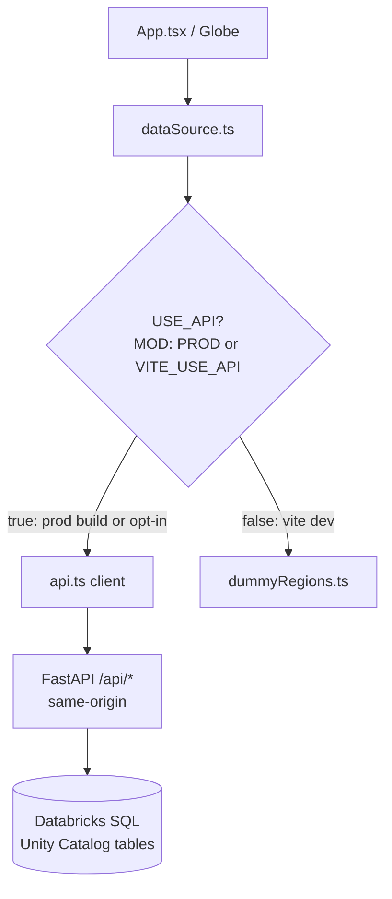
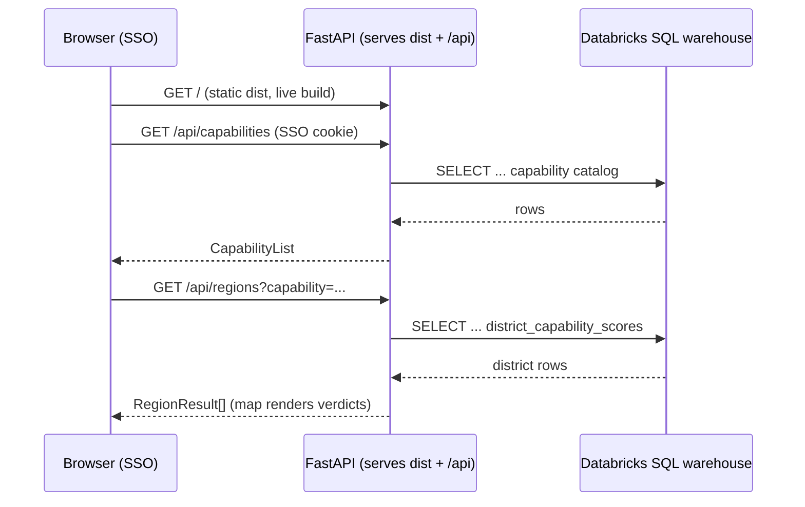

# Live API Integration — Design

**Date:** 2026-07-19
**Status:** Approved (design), pending implementation plan
**Goal:** Make the Databricks-deployed Medical Desert Planner serve **live** data
from the real Unity Catalog tables end-to-end (capability catalog + regions map),
instead of the dummy fallback currently baked into the shipped build.

## Problem

The frontend already has a typed client (`frontend/src/lib/api.ts`) mirroring the
v2.0.0 contract and a data-source switch (`frontend/src/lib/dataSource.ts`) that
serves dummy data unless `VITE_USE_API === "true"` at build time. The backend
(`backend/app`) already implements the live endpoints against Databricks SQL:
`/api/health`, `/api/capabilities`, `/api/regions`, `/api/facilities`.

The GitHub-first Databricks deploy serves the **committed `frontend/dist`**. That
committed bundle was built without the flag, so `USE_API` is `false` and the live
app shows dummy data. Confirmed: the string `dummy data` is present in the shipped
`frontend/dist/assets/*.js`.

So the endpoints and client exist; the deployed build simply never calls them.

## Approach

### 1. Make live the structural default for production builds

Change `USE_API` in `dataSource.ts` from a strict opt-in flag to:

```ts
// Live by default in any production build (Databricks serves the built dist,
// always same-origin with the API). Dummy only in `vite dev`, unless a local
// dev explicitly opts into a running backend with VITE_USE_API=true.
const USE_API =
  import.meta.env.VITE_USE_API === "true" || import.meta.env.PROD
```

Rationale: when Databricks serves the app it is *always* same-origin with the
FastAPI backend (`main.py` mounts `dist` at `/`), so a production build should
never fall back to dummy. Defaulting on `import.meta.env.PROD` removes the
"rebuilt `dist`, forgot the flag, shipped dummy again" footgun permanently.

- `vite build` (Databricks + our committed dist) → **live**
- `vite dev` → **dummy** (no backend assumed)
- `vite dev` / `vite preview` with `VITE_USE_API=true` → **live against local backend**

Alternatives considered:
- **`.env.production` with `VITE_USE_API=true`** — same outcome but depends on a
  separate file existing and being remembered. Rejected in favour of the code
  default.
- **Runtime auto-detect** (try live, fall back on error) — explicitly rejected by
  the user; adds ambiguity and hides real failures.

### 2. Rebuild and recommit `dist`

Because the committed `dist` is what deploys, the change only takes effect once we
run `vite build` and commit the regenerated bundle.

### 3. Reconcile region granularity with the map (verification checkpoint)

`/api/regions` reads `district_capability_scores` (district-level rows). The Globe
renders **by state** via `regionForState(name)`, keyed on state name; the dummy
data was state-shaped. Real district rows likely need a pick/aggregate step per
state (e.g. worst verdict, or highest risk_score, per state) or the map will not
line up. This is resolved during verification against real data, not guessed at
up front. If aggregation is needed it lives in `dataSource.ts`/`App.tsx`, not in
the API client (which stays a faithful mirror of the contract).

## Diagrams

### Data-source decision (what the change alters)



### Live request path on Databricks (runtime)



## Verification

1. **Backend against real tables (local):**
   - Resolve the Python gap: the backend uses `str | None` (PEP 604), so it needs
     Python ≥ 3.10; this machine's default is 3.9.6. Provision a modern
     interpreter (`uv` or `brew install python@3.12`), create a venv, install
     `requirements.txt`.
   - Run `uvicorn backend.app.main:app` using the working `DEFAULT` OAuth profile
     (SDK default auth chain; `databricks current-user me` already succeeds).
   - Smoke: `GET /api/health`, `/api/capabilities`, `/api/regions?capability=<id>`
     return real, non-empty rows.
2. **Frontend end-to-end (local):** run the live path against the local backend
   (`vite dev` proxy + `VITE_USE_API=true`, or `vite preview` of the prod build);
   confirm the map renders real verdicts and reconcile state/district granularity.
3. **Final (Databricks):** deploy merged `main`, open the app through SSO, confirm
   the header shows "live API" and the map shows real data.

## Scope

- **In:** capability catalog + regions map on live data, verified end-to-end and
  on Databricks; region-granularity reconciliation if needed.
- **Out:** the facility receipts panel. `getFacilities`/`fetchFacilities` exist in
  the client but no UI consumes them; building that panel is net-new UI, a
  separate feature. The live client stays ready for it.

## Files touched

- `frontend/src/lib/dataSource.ts` — `USE_API` default (live in prod).
- `frontend/dist/**` — regenerated build, recommitted.
- Possibly `frontend/src/lib/dataSource.ts` / `App.tsx` — state/district
  aggregation, only if verification shows the map needs it.
- No backend changes expected (endpoints already implemented).
