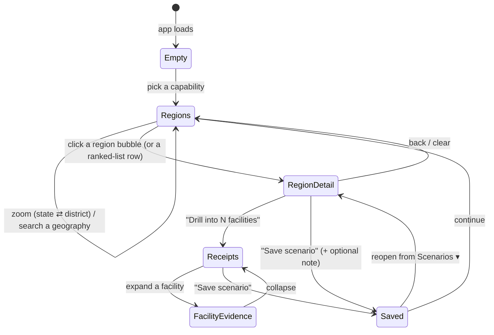

# Medical Desert Planner — UI Flow

**Date:** 2026-07-19
**Track:** Medical Desert Planner (Challenge 04 · Data Legend)
**Companion:** [globe design spec](./2026-07-19-india-healthcare-globe-design.md)

## Who + the decision

**User:** a non-technical NGO / public-health **planner**. Not a data person.
**Their question (verbatim from the brief):** *"Where are the highest-risk gaps —
and how confident are we that they are real?"*
**The decision they leave with:** a defensible shortlist of regions to act on,
saved as a **planning scenario** they can reopen, defend, and share.

## Mandatory workflow (brief → our screens)

| Brief step | Our surface |
|---|---|
| Select a capability + geography | Capability picker + geography search / zoom |
| See trust-weighted regional coverage | The India globe, regions colored by **status** |
| Drill into the facility records behind an aggregate | Region → **facility receipts** panel (tier + citations) |
| **Save a planning scenario** | **Save scenario** action → persisted, reopenable |

Everything below is one screen; panels swap by context. The map is the hero.

## Screen layout (one screen)

```
┌──────────────────────────────────────────────────────────────┐
│ TOPBAR: [Capability ▾]  [🔍 state / district / PIN]  [Scenarios ▾]│
├───────────────────────────────┬──────────────────────────────┤
│                               │  CONTEXT PANEL (right)         │
│                               │                               │
│        GLOBE OF INDIA         │  default → RANKED DESERTS      │
│   region bubbles colored by   │  region → REGION DETAIL +      │
│   status, sized by priority   │           "Drill into N        │
│                               │            facilities"         │
│                               │  facility → EVIDENCE RECEIPTS  │
│  ┌── LEGEND (always on) ──┐   │                               │
│  │🔴 medical desert       │   │  [＋ Save scenario] [✎ Note]   │
│  │🟠 claimed-unverified   │   │                               │
│  │🟡 data desert (unknown)│   │                               │
│  │🟢 served               │   │                               │
│  └────────────────────────┘   │                               │
└───────────────────────────────┴──────────────────────────────┘
```

The **legend is permanent** and states in plain words the distinction the brief
grades on: 🟡 *data desert = we don't know* vs 🔴 *medical desert = real gap*.

## The journey (state flow)



### Step 1 — Empty
Base globe of India, capability picker glowing as the call to action. Copy:
*"Pick a capability to map trust-weighted coverage across India."* No fetch yet.

### Step 2 — Regions (trust-weighted coverage)
Pick a capability (ICU, NICU, Emergency care, Maternity, Oncology, Trauma center)
→ `GET /api/regions?capability&level=state`. Each region is a bubble at its
centroid, **colored by `status`**, **sized by `priority_score`**. Zoom in past a
threshold → `level=district`; the search box jumps to a state / district / PIN
(PIN → district via the pincode directory).

- **Right panel = Ranked Deserts:** highest `priority_score` regions first, each
  row showing status chip, coverage bar, need, and a **confidence meter**
  (`knowledge`). This directly answers *"where are the highest-risk gaps."*
- Hover a bubble → tooltip: coverage, health_need, priority, claiming /
  corroborated counts.

### Step 3 — Region detail
Click a bubble (or a ranked-list row) → right panel shows the region's
trust-weighted picture in plain language:

- Big **status** verdict with one-line explanation
  (e.g. *"Likely medical desert — high maternal-health need, little trusted ICU
  supply."* vs *"Data desert — only 2 records here; we can't conclude a gap."*).
- **Coverage** (trust-weighted supply), **Need** (NFHS), **Confidence /
  knowledge** meters. Honest emptiness: a region with too few records renders as
  🟡 *data desert* with copy *"Not enough evidence to judge,"* never as a red gap.
- Primary CTA: **"Drill into N facilities →"**. Secondary: **＋ Save scenario**,
  **✎ Add note**.

### Step 4 — Facility receipts (the drill-down)
`GET /api/facilities?capability&state|district` → a list of the facilities behind
the aggregate. Each row:

- Name, city/district, **tier badge** (🟢 Corroborated / 🟠 Claimed-only), and a
  `trust_weight` contribution.
- Expand → **evidence receipts**: the `evidence` array rendered as
  *field → matching sentence* citations (e.g. `procedure → "…24/7 ICU with
  ventilator support…"`), plus `description` and `source_urls`. This is the
  brief's "trace every output back to the facility text."
- Per-facility **✎ Note / override** (e.g. *"Called — ICU confirmed"* or *"Claim
  looks false"*). Optional but cheap, and adds Facility-Trust-Desk flavor
  (multi-track integration = ambition points).

### Step 5 — Save a planning scenario (persistence)
**Save scenario** captures: `{ capability, level, region(s) of interest,
map viewport, notes, timestamp, title }`. A **Scenarios ▾** drawer lists saved
scenarios; opening one **restores** the capability, geography, and notes so work
survives the session — the explicit MDP requirement.

- **Prod:** persist to **Lakebase** (per the brief's persistence stack).
- **Local dev:** persist to `localStorage` behind the same `scenarioStore`
  interface, so the flow is fully demoable without Databricks. Swapping the store
  impl is the only change at packaging time.

## How this scores (self-check vs. the rubric)

- **Evidence & Trust (35%):** row-level `evidence` citations on every facility;
  tier badges separate strong vs weak claims; the permanent legend + status logic
  separate **data desert (🟡, unknown)** from **medical desert (🔴, real gap)** —
  the exact distinction the brief calls out.
- **Product Judgment (30%):** one screen, plain-language verdicts, a planner never
  sees a raw score without a "what this means" line; the ranked list answers the
  planner's question in one glance.
- **Technical Execution (25%):** ships as a Databricks App (globe served
  same-origin by the FastAPI backend); Lakebase for persistence.
- **Ambition (10%):** crisis-mapping stretch (globe overlay by region/PIN,
  desert-vs-unknown separation) + optional facility notes/overrides = light
  multi-track integration.

## Persistence data model (new — thread back into the design spec)

`scenarioStore` interface (localStorage in dev, Lakebase in prod):
- `saveScenario(scenario) -> id`
- `listScenarios() -> Scenario[]`
- `getScenario(id) -> Scenario`
- `deleteScenario(id)`
- `Scenario = { id, title, capability, level, regions[], viewport, notes[], createdAt }`
- `Note = { targetType: "region"|"facility", targetId, text, createdAt }`

## Open questions

1. **Scenario granularity:** is a scenario "one capability + a set of flagged
   regions," or should it also pin specific facilities from the receipts? (I've
   assumed regions + optional facility notes.)
2. **Geography search scope:** API supports state/district; do we need PIN and
   city entry in v1, or is zoom + state/district search enough?
3. **Notes/overrides:** in scope for v1, or scenario-save only? (I lean: include
   notes — they're the cheapest way to hit the persistence bar convincingly.)
```
