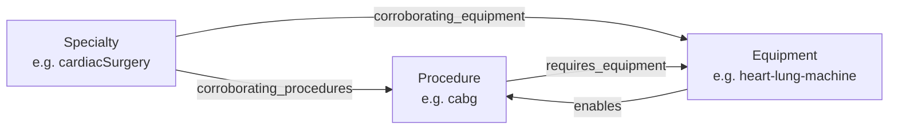

# Healthcare ontology: specialties · procedures · equipment

A small, purpose-built ontology linking the three claim vocabularies in the Virtue Foundation facilities dataset. It exists to power **cross-field corroboration** for the trust scorer: a real capability leaves correlated traces across `specialties`, `procedure`, and `equipment` — this ontology defines which traces corroborate which.

## Files

| File | Concept | Anchored to |
|---|---|---|
| [specialties.yaml](specialties.yaml) | Doctor types / medical specialties | The dataset's closed camelCase `specialties` vocabulary (ids match exactly, e.g. `gynecologyAndObstetrics`) |
| [procedures.yaml](procedures.yaml) | Treatments & procedures | Normalized concepts to match against the free-text `procedure` claims |
| [equipment.yaml](equipment.yaml) | Equipment & infrastructure | Normalized concepts to match against the free-text `equipment` claims |

## The model



Three entity types, four edge types:

- **Specialty → Procedure** (`corroborating_procedures`): procedures you'd expect to see claimed if the specialty is real.
- **Specialty → Equipment** (`corroborating_equipment`): equipment you'd expect on site.
- **Procedure → Equipment** (`requires_equipment`): equipment a procedure claim implies.
- **Equipment → Procedure** (`enables`): the reverse edge, from the equipment side.

Every entity carries `keywords` (lowercase substrings, incl. Indian-English variants like *LSCS*, *sonography*, *PSA plant*) for matching the free-text claim sentences, since the `procedure`/`equipment` columns are arrays of plain-English sentences, not codes.

## Attributes that feed the trust scorer

- **`in_prompt_vocab`** (specialties): `true` = the id is directly evidenced in the organizers' extraction prompt; `false` = plausible member of the unpublished hierarchy — verify against actual dataset values before use.
- **`care_level`** (specialties, procedures): `primary` / `secondary` / `tertiary`, loosely aligned with the Indian public tiers (PHC / CHC–district hospital / medical college). Lets the Medical Desert Planner ask level-aware questions ("which districts lack *secondary* surgical care?") instead of counting facilities flat.
- **`tier`** (equipment): `basic` / `intermediate` / `advanced` capital intensity. An unverified MRI claim matters more — and earns more corroboration credit — than an unverified ECG claim.
- **`note`**: known biases inherited from the extraction pipeline (e.g. `internalMedicine` is the default for any generic "Hospital" name, so it's the weakest specialty signal).

## How corroboration scoring uses this

For a facility claiming specialty *S*:

1. Match the facility's `procedure` sentences against keywords of `corroborating_procedures(S)` and its `equipment` sentences against `corroborating_equipment(S)`.
2. Each independent hit raises confidence that *S* is real; weight hits by equipment `tier` (an advanced-tier match is stronger corroboration) and by claim-field trust priors (see [docs/08-starter-materials.md](../docs/08-starter-materials.md) — `specialties` is the weakest field, `description` the strongest).
3. A specialty with **zero** corroborating hits and a name-derived default (see `note`) is a candidate *data desert* signal — "we don't know", not "they don't have it".
4. Conversely, procedure claims whose `requires_equipment` never appear anywhere in the facility's claims are flagged as under-evidenced.

Example: a facility claims `cardiacSurgery`. If its claims also mention "open heart surgery" (procedure `cabg`), a "cath lab" and an "ICU" (equipment), that's three independent corroborations, two of them advanced-tier — high confidence. A facility named "XYZ Heart Hospital" with `cardiacSurgery` and no matching procedure/equipment claims is unverified.

## Design decisions

- **Anchored to the dataset, not to a standard.** Ids mirror the dataset's own camelCase vocabulary rather than SNOMED/ICD, because the goal is scoring *this* dataset in a weekend, not interoperability. Keywords do the free-text bridging. (If needed later, each entity can gain a `snomed:`/`loinc:` mapping field without restructuring.)
- **Level 0–1 granularity only**, matching the extraction prompt's `LEVEL_OF_SPECIALTIES = 1` — no subspecialties, since the dataset can't contain them.
- **Trauma lives under `criticalCareMedicine`** and generic oncology under `medicalOncology`, exactly as the extraction prompt maps them — the ontology must mirror the pipeline's quirks, not medical ideal.
- **Keywords are substrings, not regexes** — apply case-insensitively; a claim sentence can match multiple concepts (that's fine, corroboration is a set union).

## Loading it

```python
import yaml, pathlib

base = pathlib.Path("ontology")
specialties = {s["id"]: s for s in yaml.safe_load((base / "specialties.yaml").read_text())["specialties"]}
procedures  = {p["id"]: p for p in yaml.safe_load((base / "procedures.yaml").read_text())["procedures"]}
equipment   = {e["id"]: e for e in yaml.safe_load((base / "equipment.yaml").read_text())["equipment"]}

def match(claims: list[str], concepts: dict) -> set[str]:
    """Which concept ids does a facility's claim list evidence?"""
    text = " ".join(claims).lower()
    return {cid for cid, c in concepts.items() if any(k in text for k in c["keywords"])}
```

Run `python ontology/validate.py` after editing — it checks that every cross-referenced id resolves and that ids are unique.
